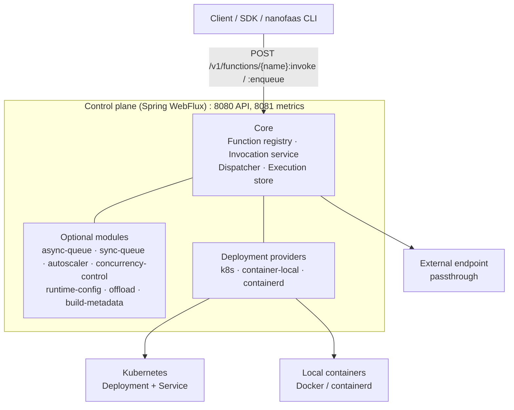

<div align="center">

# NanoFaaS

**A minimal, modular Function-as-a-Service platform for Kubernetes and plain containers.**

A single-pod control plane with an in-memory core, optional modules you compile in
only when you need them, and a native-capable CLI.

[](https://github.com/miciav/nanofaas/actions/workflows/gitops.yml)
[](https://github.com/miciav/nanofaas/actions/workflows/codeql.yml)
[](LICENSE)


[Quickstart](docs/quickstart.md) ·
[Documentation](docs/README.md) ·
[Write a function](docs/tutorial-function.md) ·
[Architecture](docs/control-plane.md)

</div>

---

## Overview

NanoFaaS deploys and invokes containerized functions. Its design priorities are
low latency, a small footprint, and a core you can read in an afternoon:

- **Small core, optional modules.** Queues, autoscaling, concurrency control,
  runtime configuration and offloading are separate modules selected at build
  time. What you do not compile in, you do not pay for.
- **Three execution modes.** Managed `DEPLOYMENT`s, `EXTERNAL` passthrough
  endpoints and in-process `LOCAL` execution behind one invocation API.
- **Pluggable backends.** Kubernetes, local Docker-compatible containers and
  rootless containerd deployment providers.
- **Non-blocking control plane.** Spring WebFlux on Java 25, with a GraalVM
  native image for fast startup and a low memory footprint.
- **Polyglot functions.** Java and Python SDKs, plus example functions in Java,
  Python, JavaScript, Go and Bash.
- **Reproducible distributions.** A versioned YAML [recipe](docs/recipes.md)
  builds a control plane and a set of functions, with their images, in one step.

> **Scope.** NanoFaaS is a research platform: a single control-plane pod, in-memory
> state and no built-in authentication. It is not a high-availability service.

## Architecture



A request enters through `POST /v1/functions/{name}:invoke` (synchronous) or
`:enqueue` (asynchronous). The control plane validates it, applies rate limiting
and idempotency, creates the execution record and dispatches it to the function's
runtime. The synchronous path uses `sync-queue` when enabled, then `async-queue`,
then dispatches inline from the core. The asynchronous path requires `async-queue`
and otherwise answers `501 Not Implemented`.

### Execution modes

| Mode | What it does |
|---|---|
| `DEPLOYMENT` | Managed deployment intent, resolved through a backend provider (`k8s`, `container-local`, `containerd`). |
| `EXTERNAL` | The function runs elsewhere; invocations are forwarded to its `endpointUrl`. |
| `LOCAL` | In-process execution, intended for testing. |

### Control-plane modules

Modules are chosen when Gradle configures the build. Each one declares its
defaults, requirements and conflicts in a `module.properties` descriptor.

| Module | Purpose |
|---|---|
| `async-queue` | Per-function queues and scheduler for the asynchronous path |
| `sync-queue` | Admission control and backpressure for synchronous calls |
| `autoscaler` | Internal replica scaler and scaling metrics |
| `concurrency-control` | Per-function concurrency governor: static, latency-adaptive or budgeted against an SLO |
| `runtime-config` | Hot runtime configuration and the admin API |
| `offload` | Transparent proxy of synchronous invocations to a remote NanoFaaS instance |
| `build-metadata` | Build diagnostics endpoint |
| `k8s-deployment-provider` | Kubernetes managed deployments |
| `container-deployment-provider` | Local managed deployments on a Docker-compatible runtime |
| `containerd-deployment-provider` | Local managed deployments on rootless containerd |

The three provider modules are mutually exclusive. See
[control-plane operation](docs/control-plane.md#control-plane-modules) for
selection rules and examples.

## Quick start

Prerequisites: Java 25 (Gradle downloads a matching JDK if none is installed) and,
for the container paths, Docker or a compatible runtime.

```bash
# Build everything and run the control plane
./gradlew build
./gradlew :control-plane:bootRun
```

In another terminal, build the CLI and talk to the control plane:

```bash
./gradlew :nanofaas-cli:installDist
CLI=clients/cli/build/install/nanofaas-cli/bin/nanofaas-cli

$CLI --endpoint http://localhost:8080 fn list
$CLI --endpoint http://localhost:8080 invoke <function> -d '{"input": "hello"}'
```

> The containerd provider depends on libraries that are not on Maven Central.
> If the build fails with `Could not find io.nanofaas:containerd-java-cni`, follow the
> [containerd deployment guide](docs/deployment-containerd.md) to stage them, or
> build without that module.

For a complete local path, including native builds and provisioning a
Kubernetes VM, read the [quickstart](docs/quickstart.md).

### Build a distribution from a recipe

```bash
./gradlew validateRecipe -Precipe=recipes/local-demo.yaml
./gradlew assembleRecipe -Precipe=recipes/local-demo.yaml
```

The recipe pins the control-plane modules, JVM or native build mode and the
functions to package. See [distribution recipes](docs/recipes.md).

## Choose the right tool

| Goal | Tool |
|---|---|
| Build, register, invoke or inspect a function | `nanofaas` CLI ([guide](docs/nanofaas-cli.md)) |
| Provision a VM, install k3s and Helm, distribute images, run E2E | [NanoLab](https://github.com/miciav/nanolab) |
| Build the image matrix or publish a release | `nanolab.sh release prepare` and `nanolab.sh run scenarios-v2/release.yaml` ([guide](docs/operations/image-releases.md)) |
| Run the control plane during development | Gradle / Spring Boot |

<details>
<summary><strong>Native builds and container images</strong></summary>

<br>

Build the standalone native CLI when GraalVM Native Image is available:

```bash
./gradlew :nanofaas-cli:nativeCompile
clients/cli/build/native/nativeCompile/nanofaas-cli --help
./gradlew :nanofaas-cli:nativeSmoke     # help, version and one HTTP command against a stub
```

Build and smoke-test every native Java target with the GraalVM release pinned in
`gradle.properties`:

```bash
scripts/native-build.sh
```

Build a native Distroless image for a service or example function:

```bash
scripts/native-java-image.sh control-plane
scripts/native-java-image.sh warm-echo
scripts/native-java-image.sh roman-numeral-lite
```

JVM images use their module Dockerfile on Distroless Java 25. Native images are
built without Spring Boot buildpacks.

</details>

<details>
<summary><strong>Selecting control-plane modules</strong></summary>

<br>

```bash
./gradlew :control-plane:bootJar -PcontrolPlaneModules=none
./gradlew :control-plane:bootJar -PcontrolPlaneModules=async-queue,autoscaler
./gradlew :control-plane:bootJar -PcontrolPlaneModules=all
```

The `NANOFAAS_CONTROL_PLANE_MODULES` environment variable is the fallback. `all`
prefers default-enabled modules when resolving conflicts, and equal-priority
conflicts fail. Strong requirements and conflicts fail before any task runs; weak
requirements are optional.

</details>

<details>
<summary><strong>Tests and end-to-end validation</strong></summary>

<br>

```bash
./gradlew test
```

Docker-backed and Kubernetes tests need their respective runtimes. End-to-end
scenarios are versioned YAML files owned by NanoLab:

```bash
export NANOFAAS_ROOT="$(pwd)"
cd ../nanolab
./nanolab.sh list
./nanolab.sh plan packages/nanolab/scenarios-v2/deployment-lifecycle-k8s.yaml \
  --environment packages/nanolab/environments/multipass.yaml
./nanolab.sh run packages/nanolab/scenarios-v2/deployment-lifecycle-k8s.yaml \
  --environment packages/nanolab/environments/multipass.yaml
```

The `persistent-recovery-*` scenarios restart only the control plane after scaling
a function to two replicas, and check that the registration, replica target and
managed backend resources are restored without recreation. See the
[E2E tutorial](docs/e2e-tutorial.md) and [testing guide](docs/testing.md).

</details>

## Repository layout

| Path | Contents |
|---|---|
| `platform/` | Common contracts, control plane and its modules |
| `clients/cli/` | Backend-neutral `nanofaas` HTTP client |
| `sdks/java/`, `sdks/python/` | Function SDKs |
| `services/java/warm-echo/` | Long-running warm-service reference |
| `functions/` | Example functions and their manifests |
| `recipes/` | Versioned distribution recipes |
| `deploy/helm/nanofaas` | Helm chart for Kubernetes |
| `docs/` | Guides, architecture notes and reference |
| `paper/` | Monograph on the platform's design and evaluation (in Italian) |

VM provisioning and scenario orchestration live in the separate
[NanoLab](https://github.com/miciav/nanolab) repository.

## Documentation

- [Documentation index](docs/README.md): guides, architecture, operations and reference.
- [Quickstart](docs/quickstart.md): local build, CLI and infrastructure paths.
- [Tutorial: writing a function](docs/tutorial-function.md): scaffold, handler, tests, deploy and invoke.
- [Observability](docs/observability.md): metrics, health, logging and tracing.
- [Release performance](docs/performance/history.md): per-release benchmark records.

## License

NanoFaaS is released under the [MIT License](LICENSE).
