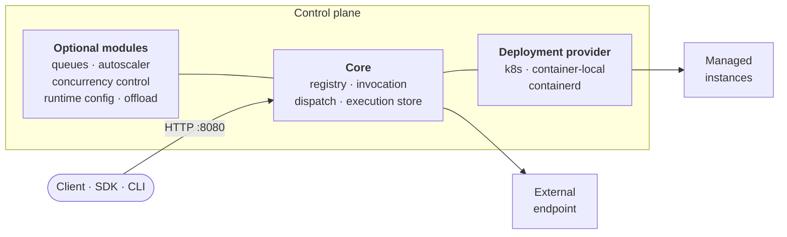

<div align="center">

# NanoFaaS

**A minimal, modular Function-as-a-Service control plane.**

[](https://github.com/miciav/nanofaas/actions/workflows/gitops.yml)
[](https://github.com/miciav/nanofaas/actions/workflows/codeql.yml)
[](LICENSE)


[Quick start](#quick-start) · [Architecture](#architecture) · [Documentation](docs/README.md) · [Write a function](docs/tutorial-function.md)

</div>

NanoFaaS registers, deploys and invokes containerized functions on Kubernetes or
on a single host. The control plane is one reactive Java service. Everything
beyond invocation (queueing, autoscaling, concurrency control, hot
reconfiguration, offloading, and each deployment backend) is a module you choose
at build time. A build contains only the modules it needs.

## Highlights

- **Build-time modularity.** Ten optional modules with declared defaults,
  requirements and conflicts, validated before a single task runs.
- **One API, three execution modes.** Managed deployments, passthrough to
  external endpoints, and in-process execution share the same invocation
  endpoints.
- **Interchangeable backends.** Kubernetes, a local Docker-compatible runtime,
  or rootless containerd.
- **Concurrency control with SLOs.** Per-function limits that are static,
  adapt to latency, or share a platform-wide budget with weighted max-min
  fairness.
- **Native builds.** The control plane, CLI and Java example functions compile
  to GraalVM native executables; services ship on Distroless images.
- **Any language.** Functions are HTTP services behind a small contract. There
  are SDKs for Java, Python, Go, JavaScript and Rust, and examples in each of
  them plus Bash.
- **Reproducible distributions.** One versioned YAML recipe builds a control
  plane and its functions, images included.

> [!NOTE]
> NanoFaaS is a research platform that favours latency and simplicity over
> availability. It runs as a single control-plane pod, keeps executions and
> queues in memory (the function catalog is persisted to a file), and has no
> authentication.

## Quick start

You need Java 25. If it is missing, Gradle downloads a JDK. Start the control
plane:

```bash
./gradlew :control-plane:bootRun
```

In a second terminal, start an example function on port 9090:

```bash
./gradlew :functions:java:word-stats:bootRun --args='--server.port=9090'
```

In a third, build the CLI, register the function and invoke it:

```bash
./gradlew :nanofaas-cli:installDist
alias nanofaas="$PWD/clients/cli/build/install/nanofaas-cli/bin/nanofaas-cli"

cat > word-stats.yaml <<'EOF'
name: word-stats
image: nanofaas/java-word-stats
executionMode: EXTERNAL
endpointUrl: http://localhost:9090/invoke
EOF

nanofaas fn apply -f word-stats.yaml
nanofaas invoke word-stats -d '{"text": "to be or not to be", "topN": 2}'
```

```json
{"executionId":"cf9360a6-…","status":"success","output":{"averageWordLength":2.17,"wordCount":6,"topWords":[{"count":2,"word":"be"},{"count":2,"word":"to"}],"uniqueWords":4},…}
```

Asynchronous invocation returns an execution ID straight away:

```bash
nanofaas enqueue word-stats -d '{"text": "hello world"}'
nanofaas exec get <executionId>
```

The CLI wraps the HTTP API, which you can also call directly:

```bash
curl -X POST http://localhost:8080/v1/functions/word-stats:invoke \
  -H 'Content-Type: application/json' -d '{"input": {"text": "hello"}}'
```

To have NanoFaaS run the function itself, register it in `DEPLOYMENT` mode with
a [deployment backend](#modules). The [quickstart guide](docs/quickstart.md)
covers Kubernetes, and the [tutorial](docs/tutorial-function.md) covers writing
your own function.

## Architecture



A synchronous call (`POST /v1/functions/{name}:invoke`) is validated,
rate-limited and checked for idempotency, then recorded in the execution store.
It goes through `sync-queue` if that module is present, otherwise through
`async-queue`, otherwise straight to the function. Asynchronous calls
(`:enqueue`) require `async-queue`; without it the API answers
`501 Not Implemented`. Metrics and health are served on port 8081.

| Execution mode | Behaviour |
|---|---|
| `DEPLOYMENT` | The control plane owns the function's instances through a deployment backend. |
| `EXTERNAL` | The function runs elsewhere; invocations are forwarded to its `endpointUrl`. |
| `LOCAL` | In-process execution, for testing. |

### Modules

| Module | Purpose | Default |
|---|---|:---:|
| `async-queue` | Per-function queues and scheduler for asynchronous calls | ✓ |
| `sync-queue` | Admission control and backpressure for synchronous calls | ✓ |
| `autoscaler` | Replica scaling driven by workload metrics | ✓ |
| `concurrency-control` | Per-function concurrency governor | ✓ |
| `runtime-config` | Hot reconfiguration through an admin API | ✓ |
| `offload` | Transparent proxying of synchronous calls to a remote NanoFaaS | ✓ |
| `build-metadata` | Build diagnostics endpoint | ✓ |
| `k8s-deployment-provider` | Kubernetes backend | ✓ |
| `container-deployment-provider` | Docker-compatible local backend | |
| `containerd-deployment-provider` | Rootless containerd backend | |

Select a set with `-PcontrolPlaneModules=<list|all|none>`; the three providers
are mutually exclusive. See [control-plane modules](docs/control-plane.md#control-plane-modules).

## Building

<details>
<summary><strong>Full build and tests</strong></summary>

<br>

The full build includes the rootless containerd provider. Its libraries resolve
from Maven Central without credentials:

```bash
./gradlew build
```

For reproducible builds from the recorded source revisions, the same guide
documents the local Maven bootstrap and `-PcontainerdMavenLocal=true` override.

Docker-backed tests need a Docker-compatible runtime. End-to-end scenarios on
containers and Kubernetes run from [NanoLab](https://github.com/miciav/nanolab);
see the [testing guide](docs/testing.md) and the [E2E tutorial](docs/e2e-tutorial.md).

Before pushing, check unused private code and public reachability candidates:

```bash
./gradlew deadCode deadCodePublic -PcontrolPlaneModules=all -PdeadCodeStrict=true --continue
```

PMD findings fail this command; the public-code report remains advisory. See the
[testing guide](docs/testing.md#unused-java-code-before-pushing) for reports and framework keep rules.

</details>

<details>
<summary><strong>Selecting modules</strong></summary>

<br>

```bash
./gradlew :control-plane:bootJar -PcontrolPlaneModules=none
./gradlew :control-plane:bootJar -PcontrolPlaneModules=async-queue,autoscaler
./gradlew :control-plane:bootJar -PcontrolPlaneModules=all
```

Each module declares its defaults, requirements and conflicts in
`platform/modules/<id>/module.properties`. An invalid selection fails before any
task runs.

</details>

<details>
<summary><strong>Native executables and images</strong></summary>

<br>

With GraalVM Native Image available:

```bash
./gradlew :nanofaas-cli:nativeCompile          # standalone CLI
scripts/native-build.sh                        # every native Java target, smoke-tested
scripts/native-java-image.sh control-plane     # native Distroless image
```

JVM images use each module's Dockerfile on Distroless Java 25.

</details>

<details>
<summary><strong>Distribution recipes</strong></summary>

<br>

```bash
./gradlew validateRecipe -Precipe=recipes/local-demo.yaml
./gradlew assembleRecipe -Precipe=recipes/local-demo.yaml
```

A recipe fixes the control-plane modules and configuration, the JVM or native
build mode, and the functions to package with their images. See
[distribution recipes](docs/recipes.md).

</details>

## Repository layout

| Path | Contents |
|---|---|
| `platform/` | Shared contracts, control plane and modules |
| `clients/cli/` | `nanofaas` command-line client |
| `sdks/` | Function SDKs for Java, Python, Go, JavaScript and Rust |
| `functions/` | Example functions in Java, Python, Go, JavaScript, Rust and Bash |
| `runtimes/watchdog/` | Rust process supervisor for function containers |
| `recipes/` | Distribution recipes |
| `deploy/helm/nanofaas/` | Helm chart |
| `docs/` | Guides, architecture notes and reference |
| `paper/` | Monograph on the design and its evaluation (Italian) |

Provisioning and end-to-end orchestration live in the companion
[NanoLab](https://github.com/miciav/nanolab) repository.

## Documentation

| | |
|---|---|
| [Quickstart](docs/quickstart.md) | Local builds, the CLI, and provisioning a Kubernetes VM |
| [Writing a function](docs/tutorial-function.md) | Scaffold, handler, tests, deployment and invocation |
| [Function lifecycle](docs/function-lifecycle.md) | Minimal HTTP function, three backend paths, invocation and catalog restart checks |
| [Function images and registries](docs/image-registries.md) | Registry setup and pull diagnostics for Docker, k3s and standalone containerd |
| [CLI guide](docs/nanofaas-cli.md) | Commands, payloads and `deploy` |
| [Control plane](docs/control-plane.md) | Modules, retries, admission, persistence |
| [Observability](docs/observability.md) | Metrics, health, logging and tracing |
| [Release performance](docs/performance/history.md) | Per-release load-test results |
| [All documentation](docs/README.md) | The complete index |

## License

Released under the [MIT License](LICENSE).
