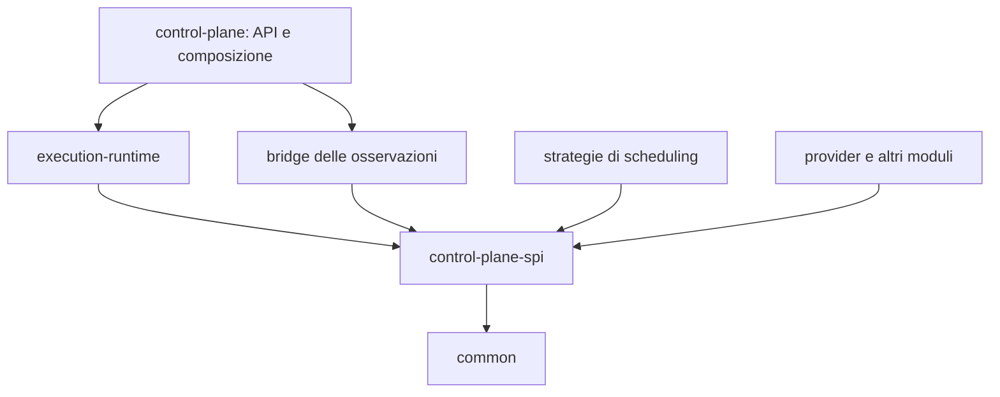

# Specifica di riferimento — issue #208

Fonte: https://github.com/miciav/nanofaas/issues/208

Snapshot del 16 settembre 2026, prima dell'aggiunta del piano. Le scelte operative del piano precisano questa specifica; non costituiscono implementazione.

## Stato e obiettivo

**Proposta architetturale da riprendere dopo la conclusione della campagna corrente. Non è ancora un piano esecutivo.**

La campagna descritta in `docs/plans/2026-09-08-control-plane-lifecycle-memory-and-modularity.md` sta correggendo lifecycle, deduplicazione, capacità e retention, e consolidando i contratti dei moduli. Questa issue conserva la direzione successiva senza modificare quel piano, richiedere cambiamenti all'agente attuale o anticiparne le estrazioni.

Quando il lavoro corrente sarà concluso, partire dal codice effettivamente ottenuto, dai test e dal consuntivo, quindi trasformare questa proposta in un nuovo piano preciso. La baseline P19 della campagna corrente sarà una misura utile, **non un ordine di interrompere o sostituire i suoi task successivi**.

**Obiettivo:** conservare entrambe le strategie di scheduling già presenti in `async-queue` e `sync-queue`, rendendole selezionabili su un motore di esecuzione comune. La strategia iniziale si sceglie tramite configurazione del control plane; l'operatore deve poterla cambiare manualmente a caldo tramite API amministrativa, senza riavvio, anche con lavoro pending e invocazioni in corso.

**Decisioni di perimetro:** mantenere le due strategie esistenti e i loro algoritmi, condividendo invarianti e suite di conformità. Non cercare uno scheduler dominante e non subordinare il mantenimento di una strategia a un vantaggio nei benchmark. Non introdurre selezione automatica/adattiva in base al workload: ogni cambio a runtime deriva da una richiesta esplicita dell'operatore. I benchmark misurano regressioni, costi e compromessi per informare la scelta manuale.

Il risultato ricercato è un'architettura in cui si possa cambiare scheduler senza riscrivere ammissione delle risorse, timeout, retry, deduplicazione, metriche e completamento.

## 1. Perché rimettere in discussione i confini attuali

Nella revisione pre-campagna descritta sotto, la distinzione tra i moduli non coincideva con SYNC/ASYNC:

- `async-queue` gestisce code per funzione e scheduling **sia per `:invoke` SYNC sia per `:enqueue` ASYNC**.
- Nel percorso SYNC, quando il gateway sync non è attivo, `ReactiveInvocationCoordinator.admitLocally` usa `QueueBackedEnqueuer`; il coordinatore aspetta poi la completion.
- `sync-queue` realizza un'altra strategia: una coda condivisa con ricerca/rotazione di candidati, admission control e stima dell'attesa.
- I descrittori attuali rendono i due moduli alternativi.
- `SyncQueueInvocationEnqueuer.enabled()` restituisce intenzionalmente false per negare la capability ASYNC, mentre `enqueue()` rimane utilizzabile dai retry. Il flag descrive quindi concetti diversi da quelli suggeriti dal nome.

Riferimenti alla revisione **locale** analizzata prima della campagna, `1d9e2f5518c21641be2e791cca9a952ca4128d34`. Questo SHA non risulta disponibile nel remoto al momento della stesura; i percorsi sotto identificano il codice letto nel checkout. Al momento del piano esecutivo, sostituire il riferimento con la revisione finale pubblicata:

- ReactiveInvocationCoordinator: instradamento SYNC e attesa del risultato: `platform/control-plane/src/main/java/it/unimib/datai/nanofaas/controlplane/service/ReactiveInvocationCoordinator.java`.
- Scheduler delle code per funzione: `platform/modules/async-queue/src/main/java/it/unimib/datai/nanofaas/modules/asyncqueue/Scheduler.java`.
- SyncScheduler: `platform/modules/sync-queue/src/main/java/it/unimib/datai/nanofaas/modules/syncqueue/scheduler/SyncScheduler.java`.
- InvocationEnqueuer e capacità: `platform/control-plane/src/main/java/it/unimib/datai/nanofaas/controlplane/service/InvocationEnqueuer.java`.
- SyncQueueInvocationEnqueuer: capability ASYNC e retry: `platform/modules/sync-queue/src/main/java/it/unimib/datai/nanofaas/modules/syncqueue/SyncQueueInvocationEnqueuer.java`.

Questi riferimenti spiegano la motivazione iniziale; non presumere che le stesse classi o gli stessi difetti esistano ancora a campagna conclusa. Nel checkout locale `8213ae81` esaminato durante il chiarimento, `InvocationEnqueuer` è già nello SPI e distingue `queueStrategy()` da `supportsAsync()`, mentre `SyncQueueInvocationEnqueuer` implementa il contratto separato `RetryScheduler`. Sono già presenti `ExecutionLifecycle`, tentativi/lease e limiti nel percorso diretto. Riutilizzare questi risultati: la descrizione storica di `enabled()` e dell'assenza di limiti non è un elenco di difetti ancora aperti.

Il problema architetturale è la sovrapposizione di quattro assi: modalità di risposta al chiamante, decisione di ammissione, algoritmo di scheduling e proprietà dell'esecuzione. Rinominare i due moduli o metterli nello stesso JAR lasciando due motori completi non risolverebbe questa sovrapposizione.

## 2. Direzione proposta e scelte ancora aperte

### Direzione da perseguire

1. **Un solo motore** possiede esecuzioni e tentativi, risultati, chiavi, limiti e cleanup.
2. **SYNC/ASYNC appartengono alla relazione con il chiamante**: attendere un risultato oppure restituire un identificativo. La modalità non seleziona implicitamente una queue.
3. **Scheduling sostituibile**: ordine di servizio, organizzazione della coda e indici possono cambiare, mantenendo invarianti comuni.
4. **Ammissione distinta dallo scheduling**: cap obbligatori nel motore; policy opzionali come rifiuto per attesa stimata consumano osservazioni esplicite.
5. **Una sola strategia attiva per istanza di control plane**, selezionata tramite configurazione all'avvio e sostituibile manualmente a caldo tramite API amministrativa. Il cambio sotto carico è un requisito della prima implementazione. Strategia effettiva e revisione sono consultabili; nessuna scelta o sostituzione automatica.
6. **Nessuna attesa consentita** è una modalità di ammissione del medesimo motore: dispatch solo se la capacità può essere acquisita subito, altrimenti rifiuto. Non è un bypass di limiti e lifecycle.
7. Il motore deve poter essere verificato senza Spring, server HTTP, Kubernetes o Docker.

### Da decidere con prove, non congelare ora

- Quale strategia esistente usare come default quando manca una scelta esplicita, con mapping compatibile dei profili precedenti. Entrambe restano supportate; la scelta del default non è una selezione degli algoritmi da conservare.
- Se basta variare la selezione su un queue store comune o se servono indici/organizzazioni diversi, garantendo in entrambi i casi il cambio manuale sotto carico e la proprietà del lavoro nel motore.
- Confine esatto tra codice comune di risveglio e meccanismi specifici dell'algoritmo.
- Packaging degli scheduler: stesso JAR o moduli distinti, purché entrambe le strategie siano componibili nello stesso artefatto e selezionabili senza ricompilazione o caricamento dinamico di codice. Superare l'attuale esclusione reciproca dei moduli nel profilo che offre il cambio a caldo.
- Policy di fairness, ordinamento dei retry, tolleranza della stima dell'attesa e parametri operativi.
- Come mantenere la compatibilità dei vecchi selettori/moduli e della capability ASYNC.
- Se e quanto la libreria `workload-metrics`, dopo la campagna corrente, abbia ancora una responsabilità indipendente.
- Dettagli della transizione: indici, sincronizzazione, limiti della pausa di selezione e gestione degli errori. Il supporto del cambio a caldo manuale è già deciso.
- Persistenza della scelta via API: chiarire se vale fino al riavvio o viene salvata e quale precedenza abbia rispetto alla configurazione iniziale.

## 3. Moduli e direzione delle dipendenze

Destinazione proposta, da confrontare con l'architettura effettivamente consegnata dalla campagna:

| Componente | Responsabilità |
|---|---|
| `common` | Modelli wire/runtime condivisi con gli SDK; nessuno stato mutabile del motore. |
| `control-plane-spi` | Contratti e DTO immutabili realmente necessari alle estensioni: dispatch, readiness, capacità osservabile, lifecycle della funzione, scheduling e osservazioni. |
| **`execution-runtime` obbligatorio** | Ammissione e budget, execution/key/outcome store, lifecycle, tentativi/lease, retry, scadenze, coordinamento dello scheduling e API di esecuzione. |
| `control-plane` | Composizione Spring, API e mapping HTTP, configurazione e persistenza delle funzioni, adapter di trasporto e orchestrazione managed. |
| Strategie di scheduling | Organizzazione del pending work e scelta del prossimo candidato; packaging da misurare. |
| Provider, offload, autoscaler, concurrency-control, runtime-config, build-metadata | Estensioni distinte con responsabilità specifiche, attraverso i port. |

Direzione di compilazione indicativa:

La composizione include a runtime le strategie/estensioni selezionate. Il motore non dipende dalle loro implementazioni. Lo SPI non dipende dal motore; i moduli non compilano contro il JAR applicativo.

`ExecutionRecord`, cache, quota ledger, executor e registry mutabili restano interni al motore. Le interfacce di ingresso possono essere esposte da una sua API ristretta; promuoverle nello SPI soltanto se esiste un consumatore esterno reale. Evitare un secondo SPI quasi identico o una libreria per ogni interfaccia.

Le metriche concrete possono restare in un adapter di osservabilità, incluso l'eventuale `workload-metrics` residuo. Gli algoritmi leggono osservazioni; non possiedono registrazione e rimozione dei meter.

L'estrazione del nuovo JAR si giustifica con test indipendenti, dipendenze controllate e proprietà del dominio. Il numero dei moduli non è una metrica di successo.

## 4. Modello del lavoro e ownership

Distinguere almeno quattro identità:

- **Esecuzione**: una richiesta ammessa, eventualmente condivisa da una chiave; ha un risultato globale.
- **Tentativo**: un singolo dispatch, iniziale o retry; ha ID/token e risorse proprie.
- **Waiter**: un chiamante che attende, con deadline e cancellazione indipendenti.
- **Generazione di funzione**: una registrazione specifica; rimuovere e ricreare lo stesso nome non la rende la stessa entità.

Lo scheduler trattiene un **ticket opaco e limitato**: identità, generazione, eligibility/not-before, eventuale deadline di coda e metadati necessari alla policy. Non deve duplicare input, output, future o interi FunctionSpec mutabili in più indici. Il payload ha un owner nel motore; metadati e indici hanno comunque un costo da contabilizzare.

| Risorsa / decisione | Owner |
|---|---|
| Record live, risultato, tombstone e protezione della chiave | Lifecycle/store del motore |
| Quota di lavoro accettato, byte trattenuti, waiter | Ammissione e lease del motore |
| Lavoro pending e nodo/index della coda | Il motore conserva la proprietà dei ticket; la strategia gestisce gli indici nel budget comune, ricostruibili o trasferibili durante il cambio |
| Diritto esclusivo a prelevare un candidato | Claim temporanea del protocollo motore/strategia |
| Slot di dispatch e cancellazione del trasporto | Tentativo del motore |
| Retry e scadenze | Motore; la strategia riceve ticket eleggibili o notifiche |
| Scheduler thread, timer ed eventuale event queue | Owner esplicito composto dal motore; shutdown unico |
| Contatori, durate e rimozione dei meter | Osservabilità comune, dopo aver garantito gli invarianti |

Le quote non sono tutte equivalenti: liberare un posto nella coda non libera i byte dell'input mentre il tentativo lo usa. La fine dell'attesa HTTP non dimostra che lavoro LOCAL non cooperativo o remoto sia terminato.

Separare le deadline: waiter, permanenza in coda, tentativo e vita massima dell'esecuzione. Il primo waiter non impone implicitamente agli altri la propria deadline. Per le chiavi condivise, budget globali e policy dell'esecuzione restano stabili secondo il contratto consegnato dalla campagna corrente.

## 5. Il contratto critico: dal candidato al dispatch

«Lo scheduler propone, il motore esegue» deve diventare un protocollo preciso. Una semplice coppia `poll()` + `tryAcquire()` può perdere un elemento o liberare risorse altrui quando intervengono cancellazione, removal o modifica dei limiti.

Schema di riferimento da prototipare; nomi e firme non sono API già decise:

1. Il motore valida/risolve la chiave e riserva l'ammissione di nuovo lavoro. Il replay riusa l'esecuzione; eventuali waiter consumano la loro quota.
2. Pubblica il ticket soltanto quando lo stato necessario a completarlo e ripulirlo esiste. Una pubblicazione fallita restituisce tutte le prenotazioni pertinenti.
3. La strategia individua e **rivendica provvisoriamente** un candidato, senza farlo sparire dal lavoro posseduto.
4. Il motore verifica identità, generazione, stato, eligibility, readiness e deadline, quindi tenta di acquisire il lease sulla capacità corrente. Le osservazioni dello scheduler sono suggerimenti e possono essere obsolete.
5. Se la capacità non c'è, la claim torna pending con ordinamento documentato; se il lavoro non è più valido, il motore conclude la sua rimozione. Nessun ritorno in coda senza owner e nessuna duplicazione di nodi.
6. Una transizione atomica convalida tentativo/claim e completa il prelievo. Se removal/expiry hanno vinto la race, il lease appena acquisito viene restituito e il backend non parte.
7. L'handle di cancellazione viene pubblicato gestendo anche la cancellazione arrivata prima dell'handle. Errore sincrono di submit, completion immediata e callback duplicata passano dallo stesso cleanup.
8. La completion aggiorna il tentativo/lifecycle, restituisce le risorse possedute e segnala nuova capacità al motore di scheduling. Il retry riusa l'owner dell'esecuzione, non riaccetta una nuova richiesta utente.

Il punto di linearizzazione va specificato nei test, insieme al confine tra commit del dispatch e chiamata al trasporto. Non promettere che la cancellazione locale impedisca effetti remoti dopo che il trasporto ha già accettato il lavoro.

Una claim non è una seconda coda invisibile: numero, tempo di vita e responsabilità di abort devono essere limitati. Lo stato di claim deve essere recuperabile anche se l'algoritmo lancia un'eccezione. Se non può esserlo, portare il motore in errore osservabile e interrompere nuove ammissioni secondo policy; non continuare perdendo lavoro.

Non invocare HTTP, readiness remota, listener o serializzazioni grandi sotto lock di coda. Evitare CAS/lock distribuiti tra motore e strategia il cui ordine non sia dimostrabile. Confrontare il protocollo generale con una variante più semplice a scheduler singolo prima di scegliere: l'astrazione non deve costare più del lavoro che organizza.

## 6. Strategie esistenti e cambio manuale a caldo

**Entrambe le strategie esistenti sono da conservare**, adattando le implementazioni corrette alla fine della campagna al contratto comune. I nomi seguenti sono descrittivi; gli ID pubblici e il mapping dei vecchi moduli vanno documentati:

| Strategia | Idea da preservare / verificare |
|---|---|
| `per-function` (attuale `async-queue`) | Conservare code per funzione, insieme delle funzioni attive, turni/batch limitati e risveglio su lavoro/capacità. |
| `shared-queue` (attuale `sync-queue`) | Conservare coda condivisa, selezione e rotazione dei candidati pronti con lavoro limitato per visita. |

Nuovi algoritmi, incluso un eventuale `weighted-fair`, sono fuori dal perimetro di questa issue.

Il motore mantiene la proprietà del pending work e delle sue risorse. Le strategie possono usare indici o organizzazioni differenti senza imporre un'unica deque a tutti gli algoritmi, ma devono consentire la ricostruzione o il trasferimento controllato dei ticket al cambio. Separare gestione delle risorse e meccanismo di claim dall'algoritmo; una strategia non può portarsi dietro un lifecycle parallelo. La fattibilità e il costo del cambio sotto carico vincolano questa scelta architetturale.

Precisare cosa significhi fairness: numero di avvii, tempo di occupazione, quota di capacità oppure latenza delle funzioni poco attive. Con job di durata diversa queste misure non coincidono. Un peso per funzione non garantisce di per sé equità nel consumo di CPU remota.

Definire inoltre:

- Ordinamento del pending work per funzione; non promettere ordine di completamento quando sono possibili più tentativi concorrenti.
- Posizione dei retry e limite alla loro quota di servizio rispetto a nuovo lavoro.
- Gestione di `notBefore`: un retry in backoff o una funzione non ready non deve bloccare altre funzioni eleggibili.
- Progressi in presenza di una funzione molto attiva e molte funzioni sporadiche.
- Condizioni della promessa di assenza di starvation: funzione pronta, capacità che torna disponibile, carico e pesi compatibili. Nessuna garanzia assoluta di latenza con backend permanentemente bloccati.
- Wake-up senza finestre perse, coalescing per generazione e attesa a riposo senza spin.
- Limiti per active-function queue, delayed index, timer e notifiche di completion; niente strutture che crescano con la storia dei nomi.

### Configurazione e API amministrativa

La configurazione del control plane sceglie la strategia iniziale. L'operatore può richiedere esplicitamente il cambio tramite l'API amministrativa `runtime-config`, estendendone il modello a namespace e revisione già esistente. Un namespace `scheduler` è una possibile forma; nomi dei campi e mapping definitivi vanno specificati in OpenAPI.

- Rendere consultabili strategie disponibili, strategia effettivamente attiva e revisione.
- Validare ID e configurazione prima di modificare lo stato. Un ID sconosciuto o una combinazione non supportata produce un errore esplicito e lascia attiva la strategia precedente.
- Serializzare i cambi concorrenti e verificare la revisione attesa, coerentemente con `runtime-config`.
- Dichiarare successo solo dopo l'attivazione effettiva. Se si adotta un'operazione asincrona, distinguere esplicitamente richiesta accettata, transizione e completamento.
- Documentare persistenza e comportamento al riavvio.

### Contratto del cambio a caldo

Il cambio deve funzionare **senza riavvio e senza richiedere lo svuotamento delle code o la conclusione di tutte le invocazioni**. Vale in entrambe le direzioni tra le due strategie.

1. Il motore conserva esecuzioni, payload, budget, capacità, waiter, deadline, retry e risultati durante tutta la transizione.
2. Le invocazioni già avviate continuano con i propri tentativi e lease. Non vengono cancellate o riavviate per effetto del cambio; completion e retry successivi restano gestiti dal motore.
3. Il lavoro pending passa alla nuova politica conservando identità, generazione, prenotazioni, deadline e `notBefore`. L'ordine di selezione successivo può cambiare secondo la strategia richiesta, senza azzerare timeout o backoff.
4. Coordinare enqueue, cancellazioni, expiry, removal, completion e cambi di capacità concorrenti. Stabilire un punto atomico di attivazione e risolvere le claim aperte a quel confine, senza perdita di ticket, doppi dispatch dello stesso tentativo o release di risorse altrui.
5. Una possibile implementazione prepara la nuova strategia e sospende brevemente la selezione per ricostruire/trasferire gli indici e attivarla. Definire come gestire gli eventi concorrenti e contabilizzare la memoria temporanea; evitare code di transizione illimitate.
6. Se la preparazione o la transizione falliscono prima dell'attivazione, la strategia precedente deve restare utilizzabile con tutto il lavoro accettato. Il rollback deve includere gli indici e le risorse della strategia, non soltanto il valore della configurazione.
7. Dopo l'attivazione, tutti i nuovi dispatch usano la nuova strategia. Timer, listener e indici della precedente vengono ritirati senza interferire con le invocazioni ancora attive.
8. Il cambio non altera capability SYNC/ASYNC, limiti, policy di ammissione o contratti HTTP; eventuali modifiche a quei parametri richiedono configurazione esplicita separata.

Una pausa limitata della selezione è ammessa; durata, memoria temporanea e impatto sulle latenze devono essere misurati con backlog realistici. Non promettere una transizione a costo zero.

La scelta è sempre manuale. Scheduler diversi per funzione, selezione adattiva e cambio automatico in base alle metriche restano fuori scope.

Conservare il vincolo iniziale di un scheduler thread dedicato e un singolo control-plane pod. Il dispatcher può avviare I/O asincrono, ma non deve bloccare il thread di selezione su rete o handler LOCAL. La concorrenza del trasporto non si deduce dal numero di thread dello scheduler.

## 7. Ammissione, modalità diretta e superficie API

Due livelli distinti:

- **Vincoli obbligatori**: limiti globali/per funzione di count e byte, waiter, capacità di dispatch e generazione valida. Non possono essere disabilitati da una policy o da uno scheduler.
- **Policy di ammissione**: soglia di profondità, attesa stimata, margine sulla deadline, eventuale classificazione del traffico. Possono rifiutare prima della saturazione fisica.

La policy riceve osservazioni con scope, unità, timestamp e disponibilità. Il budget atomico e la pubblicazione restano l'autorità finale: una stima favorevole non riserva uno slot. Un'osservazione indisponibile non vale zero; definire comportamento esplicito del predittore quando non ha campioni.

Un limite globale può rifiutare perché la piattaforma è piena, ma la stima dell'attesa di una funzione non deve usare inconsapevolmente la profondità aggregata di tutte le altre.

In modalità senza attesa, il percorso immediato usa lo stesso protocollo e gli stessi lease. Se viene introdotto un fast path, deve rispettare lavoro già pending e fairness; non sorpassare sistematicamente i ticket accodati. Preservare i limiti già introdotti dalla campagna anche quando non è presente un modulo queue.

Le strategie dovrebbero poter servire entrambi i modi API. L'abilitazione di `:enqueue` resta una capability esplicita del prodotto, compresa la retention necessaria al polling, separata dal nome dello scheduler. **Non trasformare silenziosamente un profilo che rispondeva 501 in uno che espone ASYNC**: prevedere un adapter/mapping di compatibilità e una migrazione dichiarata.

Il contratto di timeout/errore provato dalla campagna corrente resta il riferimento. Questa issue non riapre automaticamente la semantica R3 né autorizza cambiamenti collaterali a status HTTP, Retry-After, queue timeout, polling o tombstone.

## 8. Readiness, offload, controller e pull

### Readiness e controller

Il motore consuma osservazioni fresh/stale/unavailable e notifiche di disponibilità. Kubernetes/container lifecycle e wake-up rimangono dietro port: il loop dello scheduler non effettua GET sincroni e non decide come creare una replica.

Autoscaler e concurrency-control restano politiche distinte. Il primo decide repliche desiderate, il secondo limiti di concorrenza; il motore applica la capacità corrente. Una riduzione sotto il numero già attivo blocca nuovi dispatch, senza fabbricare release dei tentativi in corso.

I consumer devono leggere osservazioni prodotte dal motore effettivamente attivo. Non collegare il governor ai contatori di un'altra queue solo perché il bean esiste.

### Offload

Distinguere:

- decisione di instradare remotamente;
- lavoro accettato dal nodo locale per coordinare la chiamata remota;
- lavoro offloaded in ingresso da un vicino.

L'offload in uscita conserva budget locali di payload/pending/future, ma non finge di aver acquisito uno slot di esecuzione locale. Un rifiuto e la decisione di offload trasferiscono/rilasciano ownership una volta sola, senza lasciare contemporaneamente il ticket nella queue locale e in dispatch remoto.

La proposta #173 può diventare una classe di traffico con budget/pesi e osservazioni distinti nel motore comune. Non implementarla qui per forza e non congelare local-first, fair-share o la policy autoscaler in questa issue. L'esclusione del traffico remoto dai segnali di scaling è una decisione di prodotto da verificare, non una conseguenza automatica del nuovo scheduler.

### Pull

#206 propone acquisizione del lavoro da parte dei worker. Tenere separati **scheduling** e **trasporto/assegnazione** per non rendere il nuovo motore dipendente dal POST push.

Quando si progetterà pull, la capacità dichiarata dal worker potrà partecipare al protocollo di claim/lease. Evitare una queue nel motore seguita da un'altra queue illimitata nel dispatcher pull: occorre definire il punto in cui il lavoro passa da pending a leased e chi lo possiede.

Token di tentativo e generazione devono distinguere un risultato tardivo di un vecchio lease da quello corrente. Retry e riconsegna possono produrre più esecuzioni remote: deduplicazione dell'ammissione non equivale a exactly-once degli effetti della funzione. Il semplice completamento di una future non dimostra da solo correttezza del protocollo.

L'implementazione pull e le sue API restano fuori da questa prima riprogettazione. Al momento del piano preciso, confrontare i contratti con #206 e registrare le modifiche eventualmente necessarie alla sua proposta, senza assumere che il vecchio schema a doppia queue debba essere preservato.

## 9. Osservabilità e limiti del motore

Un vocabolario comune, indipendente dalla strategia:

- richieste offerte, ammesse, rifiutate per ragione, replay, waiter;
- pending ready, pending delayed e readiness-blocked, separati dal lavoro in tentativo;
- count/byte live e queued, quote riservate, claim aperte, tentativi e owner ritirati;
- latenza di ammissione, attesa in coda, submit, tentativo e conclusione end-to-end;
- profondità per funzione e totale, occupazione della capacità e dispatchable backlog;
- wake-up, lavoro per visita, task/queue interne, età del pending e rifiuti del predittore;
- scheduler attivo e configurazione del benchmark, con etichette a cardinalità limitata;
- esito e durata dei cambi manuali, pausa della selezione e memoria temporanea della transizione; revisione effettiva consultabile senza usarla come tag Prometheus.

Specificare quali intervalli si escludono o si sovrappongono e le relazioni di conservazione: un ticket passa da pending a claimed a dispatching senza essere contato come tre esecuzioni indipendenti. Le metriche non devono fare scansioni di tutto il backlog sotto il lock dei produttori.

A runtime normale il numero di scheduler ID/tag è limitato; niente ID di esecuzione, chiave utente o generazione come tag Prometheus. Rimozione delle funzioni e drain eliminano anche indici, timer e meter storici.

Heap pesato, heap post-GC, direct buffer, RSS e memoria delle funzioni sono misure diverse. La correttezza del ledger limita le popolazioni dichiarate, non prova da sola un tetto esatto alla RSS.

## 10. Suite comune di conformità

Prima di confrontare performance, ogni strategia deve superare lo stesso contratto. Test con clock iniettabile, barrier e dispatcher controllati; nessuna infrastruttura necessaria per la suite del motore.

| Famiglia | Casi essenziali |
|---|---|
| Modalità API | SYNC e ASYNC concorrenti sulla stessa funzione; stesso motore/capacità, diversa attesa del chiamante; compatibilità ASYNC disabilitato. |
| Ammissione | Cap globali/per funzione, count/byte/waiter, replay a cap pieno, pubblicazione che fallisce, modalità senza attesa. |
| Claim/dispatch | Capacità cambia dopo selezione; removal/expiry contro claim e commit; submit che lancia; completion immediata; un ticket non viene perso né selezionato due volte per lo stesso tentativo. |
| Deadline e retry | Waiter breve/lungo, deadline di coda e globale, retry con backoff, limite retry, risposta tardiva, nessuna starvation del lavoro nuovo. |
| Generazioni | Remove/re-register con callback e segnali vecchi sospesi; vecchi lease e indici non modificano nuova capacità o metriche. |
| Progresso | Una funzione bloccata e altre pronte, perdita di wake-up forzata, scan/turni limitati, fairness sotto carico misto. |
| Risorse | Saturazione e drain, cancel prima dell'handle, handler non cooperativo, doppia close, avvio parziale fallito, shutdown con pending. |
| Errori della strategia | Eccezione durante publish/select/claim/ack, nessuna risorsa dimenticata; modalità di errore esplicita se non è possibile continuare in sicurezza. |
| Integrazioni | Readiness indisponibile, variazione capacità dal governor, offload, metriche del backlog corrette per tutte le strategie. |
| Cambio manuale a caldo | Entrambe le direzioni con pending, invocazioni in corso, retry differiti e funzioni non ready; enqueue/completion/cancel/removal concorrenti; nessuna perdita o duplicazione, nessun reset di deadline/backoff, risorse e indici ritirati correttamente. |
| API di selezione | Configurazione iniziale, lettura di strategia/revisione, ID non valido, revisioni concorrenti, richieste ripetute e fallimento della preparazione/transizione con vecchia strategia ancora utilizzabile; nessun cambio autonomo al variare del carico. |

Portare nel nuovo motore i test R1–R8 e quelli di ammissione della campagna corrente, preservandone lo scopo; non riscriverli tutti attorno alla forma delle nuove classi. Aggiungere sequenze randomizzate/model-based dove aiutano a esplorare combinazioni di eventi, con seed riproducibile.

Una verifica di architettura deve impedire alle strategie di importare store, record mutabili, controller e implementazioni del lifecycle. La conformità comprende limiti e cleanup, non solo l'interfaccia Java e l'ordine di `poll`.

## 11. Validazione delle strategie conservate e del cambio a caldo

Entrambe le strategie esistenti restano supportate. I benchmark verificano regressioni rispetto alle implementazioni precedenti, misurano i compromessi operativi e aiutano l'operatore a scegliere. Non servono a cercare uno scheduler dominante, eliminare una delle due strategie o attivare una selezione automatica. Il default in assenza di scelta esplicita va documentato con la compatibilità dei profili esistenti.

### Workload

- Una funzione, servizio breve, basso carico: costo del percorso normale.
- Una funzione satura: capacità utile, rifiuto rapido, contesa produttori/scheduler.
- Una funzione molto attiva e 50/500 funzioni sporadiche: fairness e latenza delle meno attive.
- Durate eterogenee e burst: distinguere avvii, occupazione e goodput entro deadline.
- Backlog di funzioni senza capacità/readiness con poche funzioni pronte: head-of-line blocking.
- Carico misto SYNC/ASYNC, retry ed eventuali classi offload: isolamento e condivisione.
- Payload di dimensioni diverse, molte funzioni, churn e stop del traffico: memoria, indici e drain.
- Cambi di capacità durante il carico: progressi e correttezza del protocollo.
- Cambi manuali di scheduler in entrambe le direzioni durante carico continuo, burst e backlog con retry/readiness bloccata: continuità delle invocazioni, pausa del dispatch, latenza, memoria temporanea e cleanup dopo cambi ripetuti.
- Modalità senza coda contro modalità queued a carico supportato: costo dell'ownership comune e rispetto della fairness.

### Misure e confronti

Misurare throughput **utile completato entro il contratto**, p50/p95/p99 anche per funzione/classe, attesa massima/starvation, allocazioni per lavoro utile, CPU, heap post-GC e memoria degli indici, occupazione degli slot e costo dei rifiuti. Il dispatch rate da solo non basta; una strategia può avviare la stessa quantità di lavoro e far scadere più chiamanti.

Due livelli:

1. **Confronto isolato dello scheduler:** stesso motore, policy di ammissione, budget, readiness e servizio; cambia solo la strategia.
2. **Confronto dei profili operativi completi:** ogni strategia con policy/tuning dichiarati. Questo misura un profilo, non attribuisce il risultato al solo algoritmo.

Usare prima harness controllati per correttezza/costo, poi HTTP e NanoLab sullo stesso ambiente. Per misure di tempo avere almeno tre ripetizioni alternate, warm-up e dispersione, stesso corpus e rate offerto, più dettaglio del lavoro ammesso. Distinguere simulazione a completamento istantaneo da servizio realistico: il primo può nascondere il costo che interessa.

Confrontare con l'artefatto finale della campagna corrente. I numeri di issue storiche servono a scegliere domande da riprodurre, non a dichiarare vincente una nuova strategia.

La campagna precedente aveva già respinto due ottimizzazioni intuitive: un monitor unico migliorava la rotazione isolata ma peggiorava l'enqueue concorrente; batch più grandi non davano un miglioramento distinguibile nel profilo provato. Risultati T2: `docs/experiments/control-plane-tuning-2026-09/RESULTS.md`. Non generalizzare quei risultati a tutti i workload e non ripetere il tuning senza una nuova ipotesi.

**Criterio di accettazione:** entrambe le strategie conservate devono soddisfare il contratto comune e le soglie di regressione dichiarate. Una non conformità richiede una correzione; risultati simili o un vantaggio dell'altra strategia non autorizzano a eliminarla. Documentare costo, limiti e comportamento di ciascuna per la scelta manuale. La ricerca di algoritmi nuovi o di un vincitore unico non è un task di questa issue.

Soglie di regressione, SLO, limiti di memoria e tolleranze del predittore devono essere fissati prima degli esperimenti nel futuro piano. Non cambiare i cap a posteriori per mascherare una regressione e non usare assert wall-clock fragili nella CI ordinaria.

## 12. Migrazione dopo la campagna corrente

Questa è una sequenza di convergenza da trasformare in task dopo la review finale, non un nuovo elenco di lavoro immediato:

1. Fotografare architettura, contratti, ADR, test e baseline realmente consegnati. Mappare ciò che è già riusabile e ciò che differisce dall'ipotesi qui descritta.
2. Chiudere le decisioni del protocollo claim/lease, ownership, osservazioni e transizione manuale sotto carico. Preparare la suite di conformità indipendente, inclusi cambi in entrambe le direzioni.
3. Adattare le strategie esistenti al contratto comune senza cambiare contemporaneamente l'algoritmo; usare la stessa suite per entrambe.
4. Estrarre il motore riusando lifecycle/capacità/store corretti, con facade di compatibilità. Stabilire un solo owner per ogni esecuzione durante tutta la migrazione.
5. Implementare selezione iniziale e cambio manuale a caldo tra entrambe le strategie conservate, con transizione atomica, gestione degli errori e stato effettivo consultabile. Misurare regressioni e costo del passaggio; documentare il default e i compromessi.
6. Migrare selettori, proprietà, runtime-config, OpenAPI, metadata, Helm/Compose e hint native. Mappare esplicitamente vecchi profili e capability; evitare che un rename cambi silenziosamente il comportamento di `:invoke` o `:enqueue`.
7. Rimuovere soltanto il wiring e il codice duplicato superati dall'adattamento, quando i consumer sono migrati e il confronto funzionale/prestazionale è completo. Conservare entrambe le strategie di scheduling.
8. Eseguire verifica JVM/native, E2E NanoLab e soak mirati a indici, timer, churn e stato residuo del nuovo motore.

Il rollback della migrazione di release resta un cambio di artefatto/configurazione con procedura documentata per il lavoro in memoria. È distinto dal fallimento di un cambio manuale di scheduler nello stesso processo, che deve preservare il lavoro accettato e la strategia precedente secondo il contratto della sezione 6. Non promettere rollback senza perdita del pending su un riavvio di una piattaforma a code non durevoli. Nessuna modalità shadow che invia due volte il lavoro reale: confronti shadow, se utili, riproducono decisioni su metadati senza dispatch degli effetti.

Prima delle modifiche ai simboli, rispettare AGENTS.md/GitNexus sul checkout corretto, con impact e verifica dei chiamanti; prima di refactor/commit verificare scope e dipendenze. Un indice di un altro worktree o precedente alla campagna non è sufficiente.

## 13. Confini della proposta

Restano invariati i vincoli MVP: singolo pod, code in memoria, scheduler dedicato, Java/Spring per l'applicazione e supporto native. Nessuna coda distribuita, nuovo servizio di orchestrazione, autenticazione o promessa exactly-once degli effetti remoti.

Il cambio manuale a caldo tra le due strategie esistenti è parte di questa issue. Restano fuori scope nuovi algoritmi, selezione automatica/adattiva, scheduler diversi per funzione, pull, placement distribuito, classi offload, autoscaling predittivo e priorità pubbliche per tenant. I port devono consentire l'evoluzione senza incorporare ora tutte quelle funzionalità.

La cancellazione locale non garantisce terminazione remota. Un timeout di un handler non cooperativo non autorizza a dimenticarne le risorse. Questi limiti devono restare espliciti nei test e nella documentazione del motore.

## 14. Quando sarà pronta per diventare un piano esecutivo

- [ ] Campagna corrente conclusa: consuntivo, revisioni, test, limiti e risultati soak consultati.
- [ ] Mappa aggiornata di classi/moduli/bean e dipendenze, senza assumere che il codice pre-campagna sia ancora il punto di partenza.
- [ ] ADR su ownership, quattro identità, deadline e punto di linearizzazione del dispatch.
- [ ] Contratto delle strategie con claim/commit/abort, risvegli, errori e shutdown.
- [ ] Decisione queue store comune oppure organizzazione sostituibile, motivata da prototipi del cambio sotto carico tra entrambe le strategie.
- [ ] Matrice di compatibilità di SYNC/ASYNC, selettori dei moduli, modalità senza attesa e runtime-config.
- [ ] Entrambe le strategie esistenti conservate e componibili nello stesso artefatto; default e mapping dei vecchi profili documentati.
- [ ] Contratto dell'API di selezione manuale: strategie disponibili, revisione, successo effettivo, errori, persistenza e riavvio.
- [ ] Protocollo del cambio a caldo in entrambe le direzioni con pending e invocazioni attive: punto di attivazione, eventi concorrenti, rollback, limiti di pausa/memoria e cleanup. Nessuna dipendenza dallo svuotamento del lavoro.
- [ ] Test che il carico e le metriche non provochino cambi automatici di strategia.
- [ ] Suite di conformità e matrice sperimentale definite, con SLO/budget/tolleranze prima delle misure.
- [ ] Confine con #173 e #206 chiarito, senza aggiungere implementazioni fuori scope.
- [ ] Dipendenze Gradle e packaging proposti, inclusi costo native e profilo minimo.
- [ ] Decisioni ancora aperte enumerate con esperimento/criterio che le chiuderà.
- [ ] Nuovo piano composto da incrementi verificabili, con baseline, migrazione, rollback e registro progressi.

## Collegamenti e contesto

- #207 — domanda sul consumo di RAM e necessità del soak; la nuova architettura non ne dimostra da sola la causa né la risoluzione.
- #197 — latenza e completamenti della sync queue; contiene osservazioni storiche e descrizioni di implementazioni precedenti. Nella revisione qui letta **entrambi gli scheduler hanno un worker singolo**; non importare come fatto attuale l'affermazione storica che il percorso async non abbia un thread condiviso.
- #196 — semantica delle osservazioni del backlog e scope globale/per funzione; alcune condizioni storiche di composizione non sono più quelle dei descrittori attuali.
- #173 — code/classi per traffico offload in ingresso.
- #206 — proposta pull, da raccordare al protocollo di assegnazione senza doppia coda nascosta.
- #205 e #204 — estensioni runtime-config e composizione dei moduli, da preservare rispetto all'esito della campagna.
- Review e piano correnti: `docs/control-plane-pre-soak-review-2026-09-08.md`, `docs/plans/2026-09-08-control-plane-lifecycle-memory-and-modularity.md`; evidenze precedenti in `docs/experiments/control-plane-tuning-2026-09/`.

**Esito atteso della futura fase di progettazione:** poter descrivere con precisione quali responsabilità sono uniche, quali algoritmi sono sostituibili, quali configurazioni sono supportate e come provarlo. Solo allora questa issue diventa un piano di implementazione.

